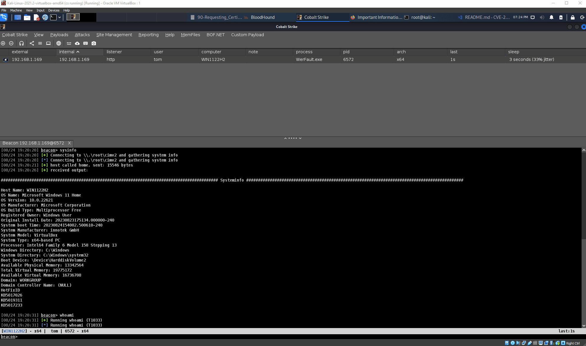

# CVE-2023-36874 Windows Error Reporting LPE BOF

## Introduction
This is a mature and operational CobaltStrike BOF implementation of Filip Dragovic's (@filip_dragovic) [CVE-2023-36874 Windows Error Reporting LPE exploit](https://github.com/Wh04m1001/CVE-2023-36874/tree/main). He did the heavy lifting in terms of creating a working exploit by reversing the vulnerable DLL in question and creating the undocumented COM structs that are critical to this exploit.

This BOF will drop a user-specified EXE to disk on the target machine and then trigger the vulnerability, resulting in the EXE being ran by SYSTEM.

Microsoft credits Google's Threat Analysis Group for disclosure of this vulnerability, however it came to my attention via [CrowdStrike's published research](https://www.crowdstrike.com/blog/falcon-complete-zero-day-exploit-cve-2023-36874/).

This blog post lists many different artifacts related to this exploit; based on the naming convention of the artifacts (8.exe, 2016.exe, 2019.exe, 10new+11.exe, etc) as well as the fact that [Microsoft released patches](https://msrc.microsoft.com/update-guide/vulnerability/CVE-2023-36874) for it going all the way back to Server 2008,  it can be inferred that this vulnerability affects quite a few different versions of Windows. 

This BOF is only functional against Windows 10 and Windows 11 21H1 - 22H2; It may work against 20H1/H2 as well, but I don't have a machine to test it. On earlier versions of Windows, this exploit will crash the process that runs it. I have a hunch this relates to differences in wercplsupport.dll COM related structures and that with some extra work this should be overcomeable, but there are lots of other exploits out there for previous versions of Windows so I will leave that task to others for now.

## Usage
Load wer_lpe.cna in CobaltStrike and the wer_lpe command will populate.

Provide the path to the EXE you want to upload, and optionally a directory that your current low-priv user has write access to. If no directory is specified, wer_lpe will attempt to write to Beacon's current directory.  

## Evasion / Customization
A couple additional features were added to the original POC in order to maintain OPSEC/try to shake static signatures as well as automatically cleanup after exploitation.

As part of the exploit, a new folder must be created in the C:\ProgramData\Microsoft\Windows\WER\ReportArchive directory. This folder will hold the Report.wer file that must be dropped to disk as part of the exploit chain. The original exploit from Filip creates a directory called "MyFolder". By looking at real folders/reports contained in the ReportArchive directory we can get a better idea of a naming convention that will better slip by low-hanging detections.

The BOF contains stubs of two real folders found within a machine's ReportArchive (one is commented out) directory. At runtime, wer_lpe will randomly generate a GUID and append it to the selected stub in order to create a believable (and statistically unique) folder in which to create the Report.wer file.

The report.wer file is another easy static indicator by which this exploit can be detected. The original exploit packages the Report.wer file as a resource within the EXE; this BOF will locate and read in 'Report.wer' from the exploit directory on the attack machine and send it to the Beacon to write to disk. This opens the door to user's replacing the pre-packaged Report.wer file with an arbitrary one of their choosing.

Several of the COM calls within the exploit require arbitrary strings in order for the exploit to proceed; these have also been replaced with runtime-generated random strings.

Being that this exploit runs an arbitrary EXE, cleanup can become something of a problem if you want your EXE to run continuously (in the case of having it run a new Beacon) because the EXE will be locked on disk. Wer_lpe has implemented the [Self-Deletion](https://github.com/LloydLabs/delete-self-poc) created by LloydLabs (which I continue to get fantastic mileage out of) in order to combat this issue. Wer_lpe will attempt to delete/cleanup all files and directories created during the course of the exploit and provide a status report of it's success/failure in doing so.

## Notes
Because trying to run an unsigned, arbitrary EXE in 2023 on a target machine is often an exercise in futility, I explored trying to have the exploit run the REAL wermgr.exe (copied into an arbitrary directory) in order to take advantage of DLL sideloading opportunities. Due to the nature of the exploit, this is not possible. See [this Twitter thread](https://twitter.com/jonasLyk/status/1694508890933608923?s=20) for more details.

This exploit will fail if ran by a user who has local Admin rights on the machine; this is due to the vulnerable code impersonating the user with (paraphrasing) the "highest available integrity". For a user who is a local Admin, this means that their Admin token will be impersonated, which has a separate DOS device map than their medium integrity token which has the requisite redirection implemented in order to trigger the vulnerability. This exploit is not a replacement for a UAC bypass. 

## Mitigation
Microsoft released a patch for this vulnerability on July 11, 2023 as part of the monthly security update for almost all conceivable OS's that people might still be running; patch your machines people.

## Credits / Resources
First and foremost, huge thanks to Filip Dragovic (@filip_dragovic) for his [working code](https://github.com/Wh04m1001/CVE-2023-36874/tree/main) as well as his willingness to chat with me and educate me on his development process for this exploit.

CrowdStrike for their [article](https://www.crowdstrike.com/blog/falcon-complete-zero-day-exploit-cve-2023-36874/).  
LloydLabs for his [Self Deletion](https://github.com/LloydLabs/delete-self-poc) code.  
